<div align="center">


<p>
  
  
  
  
  
</p>

<h3><em>শূন্য থেকে modern JavaScript developer — variable scoping থেকে শুরু করে async/await, module system আর সেরা practice পর্যন্ত</em></h3>


</div>

---

## 👤 এই হ্যান্ডবুক কাদের জন্য

| বিষয় | বিস্তারিত |
|---|---|
| 🎯 **Prerequisites** | HTML/CSS-এর basic ধারণা, প্রোগ্রামিং-এর মৌলিক concept (variable, function, loop) |
| 🧭 **Scope** | ECMAScript 2015 (ES6) থেকে শুরু করে ES2024 পর্যন্ত সব গুরুত্বপূর্ণ feature |
| 📦 **Runtime** | Browser JavaScript engine (V8, SpiderMonkey) + Node.js **20+** |
| 🗣️ **ভাষা** | ব্যাখ্যা বাংলায় — code / API / term ইংরেজিতে |
| 🚫 **এই handbook-এ নেই** | React/Vue-এর মতো framework, TypeScript (এগুলো আলাদা handbook-এর বিষয়) — এটা **pure JavaScript language**-এর উপর |

---

## 🧭 কীভাবে এই handbook পড়বে

এই guide **Phase** নয় — **Module** আকারে সাজানো, প্রতিটা একেকটা স্বতন্ত্র ভাষাগত দক্ষতা। তিনটা **Track**-এ ভাগ করা আছে:

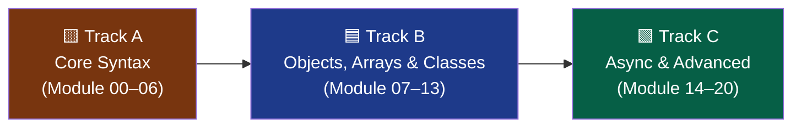

---

## 📑 Contents

<table>
<tr>
<td valign="top" width="33%">

**🟨 Track A — Core Syntax**
- [Module 00 — Setup & Mental Model](#module-00--setup--mental-model)
- [Module 01 — let, const & Scope](#module-01--let-const--scope)
- [Module 02 — Template Literals](#module-02--template-literals)
- [Module 03 — Arrow Functions](#module-03--arrow-functions)
- [Module 04 — Destructuring](#module-04--destructuring)
- [Module 05 — Spread & Rest](#module-05--spread--rest-operator)
- [Module 06 — Default Parameters](#module-06--default-parameters)

</td>
<td valign="top" width="33%">

**🟦 Track B — Objects, Arrays & Classes**
- [Module 07 — Enhanced Object Literals](#module-07--enhanced-object-literals)
- [Module 08 — Array Methods](#module-08--array-methods-mapfilterreduce)
- [Module 09 — Classes](#module-09--classes)
- [Module 10 — Modules (import/export)](#module-10--modules-importexport)
- [Module 11 — Iterators & for...of](#module-11--iterators--forof)
- [Module 12 — Generators](#module-12--generators)
- [Module 13 — Symbol & Map/Set](#module-13--symbol--mapset)

</td>
<td valign="top" width="33%">

**🟩 Track C — Async & Advanced**
- [Module 14 — Promises](#module-14--promises)
- [Module 15 — Async/Await](#module-15--asyncawait)
- [Module 16 — Optional Chaining & Nullish Coalescing](#module-16--optional-chaining--nullish-coalescing)
- [Module 17 — Error Handling](#module-17--error-handling)
- [Module 18 — Proxy & Reflect](#module-18--proxy--reflect)
- [Module 19 — Tooling & Best Practices](#module-19--tooling--best-practices)
- [Module 20 — Build Track](#module-20--project-build-track)

</td>
</tr>
</table>

---

## ⚠️ আগে জেনে নাও — ES5 vs আজকের JavaScript

| পুরোনো ধারণা (ES5) | এখনকার JavaScript (ES6+) |
|---|---|
| `var` দিয়ে variable declare | **`let`/`const`** — block scope, predictable |
| `function` keyword দিয়ে callback | **Arrow function** — সংক্ষিপ্ত, lexical `this` |
| String concatenation (`+`) | **Template literals** (`` `${}` ``) |
| Callback hell / নেস্টেড callback | **Promise** ও **async/await** |
| `arguments` object দিয়ে variable args | **Rest parameters** (`...args`) |
| `Object.assign()` দিয়ে merge | **Spread operator** (`{...obj}`) |
| `require()` (CommonJS) | **ES Modules** (`import`/`export`) — browser-এ native |
| Prototype-based inheritance হাতে লেখা | **`class`** syntax (এখনো prototype-ই, কিন্তু পরিষ্কার) |
| `for` loop দিয়ে array iterate | **`map`/`filter`/`reduce`/`for...of`** |
| `typeof x !== 'undefined' && x !== null` | **Optional chaining** (`?.`) ও **nullish coalescing** (`??`) |

---

## Module 00 — Setup & Mental Model

### JavaScript ES6+ আসলে কী বদলায়

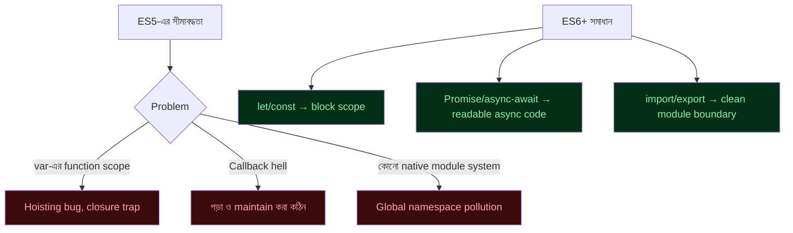

### 🧰 Analogy
> **ES5** = হাতে-কাটা কাঠের সরঞ্জাম দিয়ে ঘর বানানো — কাজ হয়, কিন্তু ধীর ও ভুলের সুযোগ বেশি। **ES6+** = power tools ও পরিমাপ করা blueprint — একই ঘর, কিন্তু দ্রুত, পরিষ্কার, নির্ভরযোগ্য।

### Environment Setup

```bash
node -v          # Node.js version চেক (20+ থাকা উচিত)

# একটা নতুন প্রজেক্ট শুরু
mkdir js-playground && cd js-playground
npm init -y

# package.json-এ ES Module সাপোর্ট চালু করতে:
```

```json
{
  "name": "js-playground",
  "type": "module",
  "scripts": {
    "start": "node index.js"
  }
}
```

```js
// index.js
console.log("Hello, ES6+!");
```

```bash
node index.js
```

> ❌ **Common mistake:** `package.json`-এ `"type": "module"` না দিয়ে `import`/`export` ব্যবহার করা — Node.js এতে error দেবে (`SyntaxError: Cannot use import statement outside a module`)।

---

## Module 01 — let, const & Scope

### Definition
`let` ও `const` হলো block-scoped variable declaration — মানে তারা শুধু সেই `{}` ব্লকের ভেতরেই বেঁচে থাকে যেখানে declare হয়েছে। `var` এর বিপরীতে, যেটা পুরো function-scope জুড়ে "hoist" হয়ে যায়।

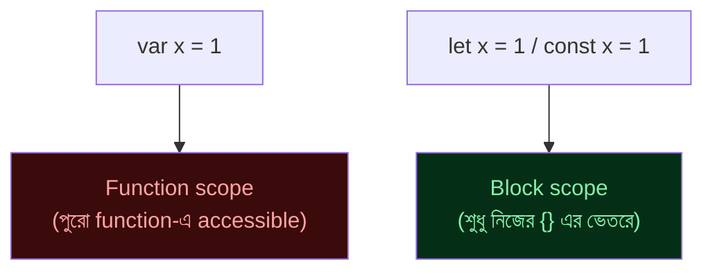

```js
// var — function scope, hoisting সমস্যা তৈরি করে
if (true) {
  var name = "Rahim";
}
console.log(name);   // "Rahim" — বাইরেও accessible, অপ্রত্যাশিত!

// let — block scope, প্রত্যাশিত আচরণ
if (true) {
  let age = 25;
}
console.log(age);    // ❌ ReferenceError: age is not defined

// const — reassign করা যায় না, কিন্তু object/array mutate করা যায়
const user = { name: "Karim" };
user.name = "Salim";     // ✅ ঠিক আছে — object-এর property বদলানো
user = {};                // ❌ TypeError — নতুন object assign করা যাবে না
```

### `let` vs `const` — কখন কোনটা

| | `let` | `const` |
|---|---|---|
| Reassign করা যায়? | ✅ | ❌ |
| Object/array mutate করা যায়? | ✅ | ✅ (reference বদলায় না, content বদলায়) |
| Default choice | ❌ | ✅ **সবসময় `const` দিয়ে শুরু করো** |

> 💡 **Best practice:** ডিফল্টভাবে `const` ব্যবহার করো। শুধু যখন জানো যে variable-টা পরে reassign হবে (যেমন loop counter, accumulator), তখনই `let`-এ যাও। `var` আধুনিক কোডে ব্যবহার করার কোনো কারণ নেই।

> ❌ **Common mistake:** Temporal Dead Zone ভুলে যাওয়া — `let`/`const` declare হওয়ার আগে ব্যবহার করলে `ReferenceError` আসে, `var`-এর মতো `undefined` না।

---

## Module 02 — Template Literals

### Definition
Backtick (`` ` ``) দিয়ে string লেখার পদ্ধতি, যেখানে `${}` দিয়ে সরাসরি expression বসানো যায় এবং multi-line string সহজে লেখা যায়।

```js
const name = "Nadia";
const age = 24;

// ❌ পুরোনো concatenation পদ্ধতি
const oldWay = "নাম: " + name + ", বয়স: " + age;

// ✅ Template literal
const newWay = `নাম: ${name}, বয়স: ${age}`;

// Expression সরাসরি বসানো যায়
const total = `মোট: ${10 * 5} টাকা`;

// Multi-line string — সহজেই, \n ছাড়া
const message = `
  প্রিয় ${name},
  আপনার অর্ডারটি প্রস্তুত হয়েছে।
  ধন্যবাদ!
`;
```

### Tagged Templates (advanced)

```js
function highlight(strings, ...values) {
  return strings.reduce((acc, str, i) =>
    `${acc}${str}${values[i] ? `<b>${values[i]}</b>` : ""}`, "");
}

const output = highlight`দাম: ${100} টাকা, ছাড়: ${20}%`;
// "দাম: <b>100</b> টাকা, ছাড়: <b>20</b>%"
```

> ❌ backtick-এর ভেতরে সাধারণ single/double quote-এর মতো `+` দিয়ে জোড়া লাগানো — এটা template literal-এর পুরো সুবিধাকে বাতিল করে দেয়।

---

## Module 03 — Arrow Functions

### Definition
Arrow function হলো function লেখার সংক্ষিপ্ত syntax, যেটা নিজের `this` তৈরি করে না — বরং **lexical scope** থেকে `this` "ধার" নেয়।

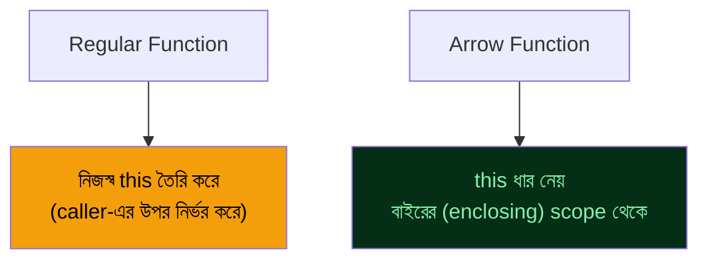

```js
// সাধারণ function syntax
function add(a, b) {
  return a + b;
}

// Arrow function — একই কাজ, সংক্ষিপ্ত
const addArrow = (a, b) => a + b;

// একটা parameter হলে () optional
const square = x => x * x;

// একাধিক statement হলে {} ও return লাগবে
const processUser = (user) => {
  const formatted = user.name.toUpperCase();
  return formatted;
};

// Object return করতে () দিয়ে wrap করো
const makeUser = (name) => ({ name, active: true });
```

### `this`-এর আচরণ — সবচেয়ে গুরুত্বপূর্ণ পার্থক্য

```js
class Timer {
  constructor() {
    this.seconds = 0;
  }

  // ❌ Regular function — 'this' undefined হয়ে যায় callback-এর ভেতরে
  startBroken() {
    setInterval(function () {
      this.seconds++;   // TypeError বা NaN — 'this' এখানে Timer instance না
    }, 1000);
  }

  // ✅ Arrow function — বাইরের 'this' (Timer instance) ধরে রাখে
  startFixed() {
    setInterval(() => {
      this.seconds++;   // সঠিকভাবে Timer instance-এর seconds বাড়ায়
    }, 1000);
  }
}
```

> ❌ **Common mistake:** object method বা class method হিসেবে arrow function ব্যবহার করা যখন তোমার dynamic `this` দরকার (যেমন event listener-এ `e.currentTarget`)। Arrow function সেই ব্যবহারের জন্য উপযুক্ত না।

---

## Module 04 — Destructuring

### Definition
Array বা object থেকে সরাসরি ভেঙে আলাদা variable-এ বের করে আনার syntax।

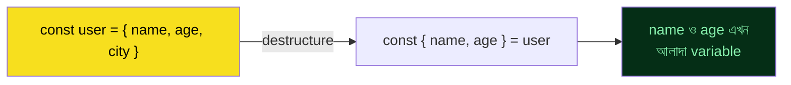

```js
// Object destructuring
const user = { name: "Fahim", age: 28, city: "Dhaka" };
const { name, age } = user;
console.log(name, age);   // "Fahim" 28

// নতুন নামে রাখা (rename)
const { name: userName } = user;

// Default value
const { country = "Bangladesh" } = user;

// Nested destructuring
const response = { data: { user: { id: 1, email: "a@b.com" } } };
const { data: { user: { email } } } = response;

// Array destructuring
const [first, second, ...rest] = [10, 20, 30, 40];
console.log(first, second, rest);   // 10 20 [30, 40]

// স্কিপ করা
const [, , third] = [1, 2, 3];

// Function parameter-এ destructuring — খুবই common pattern
function greetUser({ name, age }) {
  return `হ্যালো ${name}, আপনার বয়স ${age}`;
}
greetUser(user);

// Swap variable — destructuring-এর মজার ব্যবহার
let a = 1, b = 2;
[a, b] = [b, a];   // এক লাইনে swap
```

> ❌ nested object-এ property না থাকলে destructure করার চেষ্টা করা — `Cannot destructure property of undefined` error দেবে। Default value বা optional chaining দিয়ে safe রাখো।

---

## Module 05 — Spread & Rest Operator

### Definition
`...` (তিনটা dot) দুই দিকে কাজ করে — **spread** (ছড়িয়ে দেওয়া) আর **rest** (বাকিটা জড়ো করা)। Context অনুযায়ী কোনটা বোঝায় তা নির্ধারিত হয়।

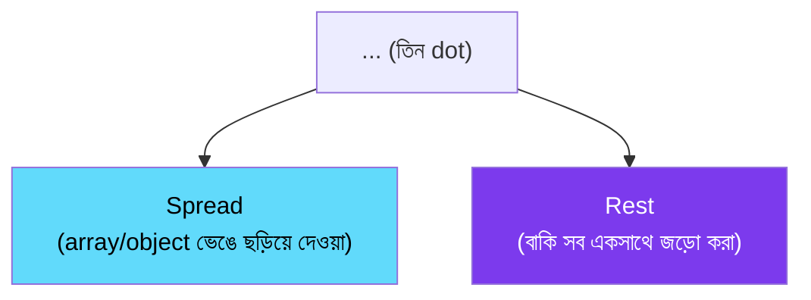

```js
// Spread — array copy/merge
const arr1 = [1, 2, 3];
const arr2 = [...arr1, 4, 5];        // [1, 2, 3, 4, 5]
const copy = [...arr1];               // shallow copy, নতুন array

// Spread — object copy/merge (immutable update-এর মূল কৌশল)
const user = { name: "Tania", age: 22 };
const updatedUser = { ...user, age: 23 };   // { name: "Tania", age: 23 }

// Spread — function argument হিসেবে
const numbers = [5, 2, 8, 1];
console.log(Math.max(...numbers));   // 8

// Rest — function parameter-এ variable সংখ্যক argument ধরা
function sum(...numbers) {
  return numbers.reduce((total, n) => total + n, 0);
}
sum(1, 2, 3, 4);   // 10

// Rest — destructuring-এ বাকি অংশ ধরা
const { id, ...otherFields } = { id: 1, name: "X", email: "x@x.com" };
```

> ❌ **Common mistake:** spread-কে "deep clone" ভাবা — এটা শুধু **shallow copy**। Nested object/array এখনও reference share করে:
> ```js
> const original = { info: { age: 20 } };
> const copy = { ...original };
> copy.info.age = 99;
> console.log(original.info.age);   // 99 — original-ও বদলে গেছে!
> ```
> Deep clone দরকার হলে `structuredClone()` ব্যবহার করো।

---

## Module 06 — Default Parameters

```js
// ❌ পুরোনো পদ্ধতি (ES5)
function greet(name) {
  name = name || "অতিথি";
  return `স্বাগতম, ${name}`;
}

// ✅ ES6 default parameter
function greetNew(name = "অতিথি") {
  return `স্বাগতম, ${name}`;
}

// পূর্ববর্তী parameter-এর উপর ভিত্তি করে default
function createRectangle(width, height = width) {
  return { width, height };   // height না দিলে width-ই height হবে
}

// Destructuring-এর সাথে default
function fetchData({ url, method = "GET", timeout = 5000 } = {}) {
  console.log(url, method, timeout);
}
fetchData({ url: "/api" });   // method="GET", timeout=5000
```

> 💡 **Difference:** `name || "default"` (ES5 pattern) falsy value (`0`, `""`, `false`) থাকলেও default বসিয়ে দেয় — যেটা bug হতে পারে। ES6 default parameter শুধু `undefined` হলেই কাজ করে, তাই বেশি নির্ভুল।

---

## Module 07 — Enhanced Object Literals

```js
const name = "Rima";
const age = 30;

// Shorthand property — key ও variable নাম একই হলে
const user = { name, age };   // { name: "Rima", age: 30 }

// Shorthand method
const calculator = {
  // ❌ পুরোনো: add: function(a, b) { return a + b; }
  add(a, b) {                  // ✅ ES6 shorthand
    return a + b;
  },
};

// Computed property name — variable দিয়ে key নাম তৈরি
const key = "dynamicKey";
const obj = {
  [key]: "কিছু একটা মান",
  [`${key}_2`]: "আরেকটা মান",
};

// Object destructuring + spread একসাথে — immutable update pattern
function updateAge(user, newAge) {
  return { ...user, age: newAge };   // মূল user বদলায় না, নতুন object ফেরত
}
```

---

## Module 08 — Array Methods (map/filter/reduce)

### Definition
Array-এর উপর loop চালানোর জন্য নতুন, declarative method — যেগুলো নতুন array/value **return** করে, মূল array বদলায় না (non-mutating)।

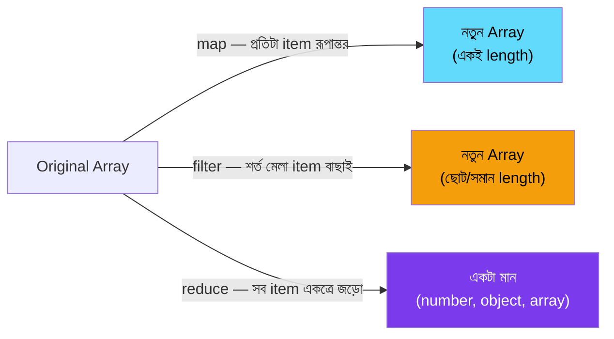

```js
const products = [
  { name: "জুতা", price: 1200, inStock: true },
  { name: "শার্ট", price: 800, inStock: false },
  { name: "প্যান্ট", price: 1500, inStock: true },
];

// map — প্রতিটা item রূপান্তর করে নতুন array
const names = products.map((p) => p.name);
// ["জুতা", "শার্ট", "প্যান্ট"]

// filter — শর্ত সত্যি হলে item রাখা
const available = products.filter((p) => p.inStock);
// [{জুতা...}, {প্যান্ট...}]

// reduce — সব item একত্রে জড়ো করে একটা ফলাফল
const totalPrice = products.reduce((sum, p) => sum + p.price, 0);
// 3500

// চেইন করে একসাথে ব্যবহার — খুবই common pattern
const availableNames = products
  .filter((p) => p.inStock)
  .map((p) => p.name);
// ["জুতা", "প্যান্ট"]

// অন্যান্য গুরুত্বপূর্ণ method
products.find((p) => p.name === "শার্ট");     // প্রথম মিল খুঁজে বের করা
products.some((p) => p.price > 1000);          // অন্তত একটা শর্ত মেলে?
products.every((p) => p.inStock);              // সবগুলো শর্ত মেলে?
products.forEach((p) => console.log(p.name));  // শুধু iterate, কিছু return করে না
```

| Method | Return করে | মূল Array বদলায়? |
|---|---|---|
| `map()` | নতুন array (একই length) | ❌ |
| `filter()` | নতুন array (ছোট/সমান) | ❌ |
| `reduce()` | একটা single মান | ❌ |
| `forEach()` | `undefined` | ❌ (কিন্তু side-effect করতে পারে) |
| `push()`/`splice()` | — | ✅ **mutates!** |

> ❌ **Common mistake:** `map()` শুধু side-effect (যেমন `console.log`) এর জন্য ব্যবহার করা এবং return value ফেলে দেওয়া — সেক্ষেত্রে `forEach()` উপযুক্ত। `map()` ব্যবহার করো শুধু যখন নতুন array দরকার।

---

## Module 09 — Classes

### Definition
`class` হলো JavaScript-এর prototype-based inheritance লেখার পরিষ্কার syntax — ভেতরে এখনও prototype chain-ই কাজ করে, কিন্তু syntax অনেক পরিচিত (Java/Python-এর মতো)।

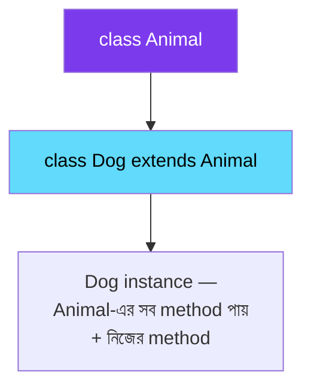

```js
class Animal {
  constructor(name, sound) {
    this.name = name;
    this.sound = sound;
  }

  makeSound() {
    return `${this.name} বলছে: ${this.sound}`;
  }

  // Static method — instance ছাড়াই class থেকে সরাসরি কল করা যায়
  static compare(a, b) {
    return a.name.localeCompare(b.name);
  }

  // Getter/Setter
  get description() {
    return `এটা একটা ${this.name}`;
  }
}

class Dog extends Animal {
  constructor(name) {
    super(name, "ঘেউ ঘেউ");   // parent constructor কল করা বাধ্যতামূলক
    this.legs = 4;
  }

  fetch() {
    return `${this.name} বল আনতে দৌড়াচ্ছে!`;
  }
}

const dog = new Dog("টমি");
console.log(dog.makeSound());     // "টমি বলছে: ঘেউ ঘেউ" — inherited method
console.log(dog.fetch());          // নিজের method
console.log(Animal.compare(dog, dog));

// Private field (# দিয়ে) — ES2022+
class BankAccount {
  #balance = 0;   // সত্যিকারের private — class-এর বাইরে থেকে access করা যায় না

  deposit(amount) {
    this.#balance += amount;
  }

  getBalance() {
    return this.#balance;
  }
}
const account = new BankAccount();
account.deposit(500);
console.log(account.getBalance());   // 500
console.log(account.#balance);        // ❌ SyntaxError — বাইরে থেকে access নিষিদ্ধ
```

> ❌ `super()` কল না করে child class-এর constructor-এ `this` ব্যবহার করা — `ReferenceError: Must call super constructor` আসবে।

---

## Module 10 — Modules (import/export)

### Definition
ES Modules হলো JavaScript-এর native file-splitting সিস্টেম — code-কে আলাদা ফাইলে ভাগ করে, প্রয়োজন অনুযায়ী একে অপরের সাথে যুক্ত করা।


```js
// math.js — named export (একাধিক জিনিস export করা যায়)
export function add(a, b) {
  return a + b;
}
export const PI = 3.1416;

// math.js — default export (প্রতি ফাইলে সর্বোচ্চ একটা)
export default function multiply(a, b) {
  return a * b;
}
```

```js
// app.js — import করা
import multiply, { add, PI } from "./math.js";   // default + named একসাথে
import { add as addNumbers } from "./math.js";     // rename করে import
import * as MathUtils from "./math.js";              // সব একসাথে namespace হিসেবে

console.log(add(2, 3));
console.log(multiply(2, 3));
console.log(MathUtils.PI);
```

| | Named Export | Default Export |
|---|---|---|
| প্রতি ফাইলে সংখ্যা | একাধিক | সর্বোচ্চ ১টা |
| Import-এর সময় নাম | `{}` দিয়ে, একই নাম রাখতে হয় (বা `as`) | যেকোনো নাম দেওয়া যায় |
| কখন ব্যবহার | utility function, constant | class বা main component/module |

> ❌ Browser-এ `<script>` দিয়ে module load করতে `type="module"` না দেওয়া — এটা ছাড়া `import`/`export` কাজ করবে না।

---

## Module 11 — Iterators & for...of

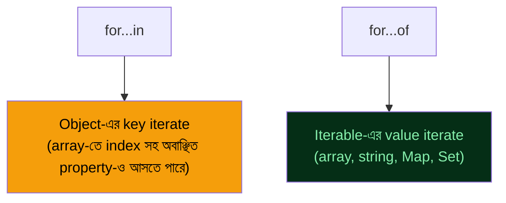

```js
const fruits = ["আম", "কাঁঠাল", "লিচু"];

// for...of — value সরাসরি পাওয়া যায়, সবচেয়ে পরিষ্কার
for (const fruit of fruits) {
  console.log(fruit);
}

// index দরকার হলে entries()
for (const [index, fruit] of fruits.entries()) {
  console.log(index, fruit);
}

// String-ও iterable
for (const char of "নমস্কার") {
  console.log(char);
}

// ❌ for...in — array-তে ব্যবহার এড়িয়ে চলো
for (const index in fruits) {
  console.log(index);   // "0", "1", "2" — string, number না! এবং prototype property-ও আসতে পারে
}
```

> ❌ **Common mistake:** array iterate করতে `for...in` ব্যবহার করা — এটা key/index দেয় (string হিসেবে), আর prototype chain-এর enumerable property-ও ধরে ফেলতে পারে। Array-এর জন্য সবসময় `for...of` বা array method ব্যবহার করো।

---

## Module 12 — Generators

### Definition
Generator function (`function*`) এমন একটা function যেটা মাঝপথে "থেমে" গিয়ে, দরকার হলে আবার সেখান থেকেই চালু হতে পারে — `yield` keyword দিয়ে।

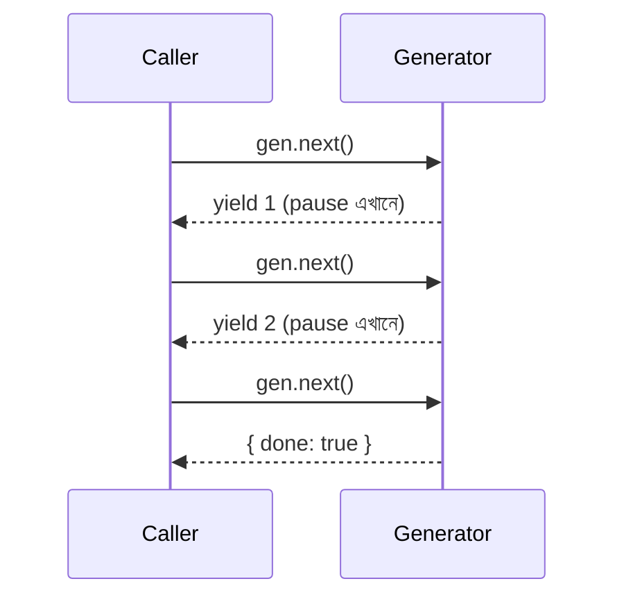

```js
function* numberGenerator() {
  yield 1;
  yield 2;
  yield 3;
}

const gen = numberGenerator();
console.log(gen.next());   // { value: 1, done: false }
console.log(gen.next());   // { value: 2, done: false }
console.log(gen.next());   // { value: 3, done: false }
console.log(gen.next());   // { value: undefined, done: true }

// for...of দিয়ে সরাসরি iterate করা যায়
for (const num of numberGenerator()) {
  console.log(num);   // 1, 2, 3
}

// বাস্তব ব্যবহার — অসীম (infinite) sequence, লাগলে তবেই মান বের হয়
function* idGenerator() {
  let id = 1;
  while (true) {
    yield id++;
  }
}
const ids = idGenerator();
console.log(ids.next().value);   // 1
console.log(ids.next().value);   // 2
```

> 💡 Generator মূলত custom iterator বানানো, lazy evaluation, বা জটিল async flow control (async library-এর ভেতরে) করার জন্য ব্যবহৃত হয়। দৈনন্দিন কাজে কম লাগলেও, বুঝে রাখা গুরুত্বপূর্ণ।

---

## Module 13 — Symbol & Map/Set

### Symbol — সম্পূর্ণ unique identifier

```js
const id1 = Symbol("id");
const id2 = Symbol("id");
console.log(id1 === id2);   // false — প্রতিটা Symbol অনন্য, এমনকি একই description হলেও

// Object property key হিসেবে — কখনো accidental collision হয় না
const user = {
  name: "Sami",
  [id1]: "secret-token-value",
};
```

### Map — key-value pair, যেকোনো type-কে key বানানো যায়

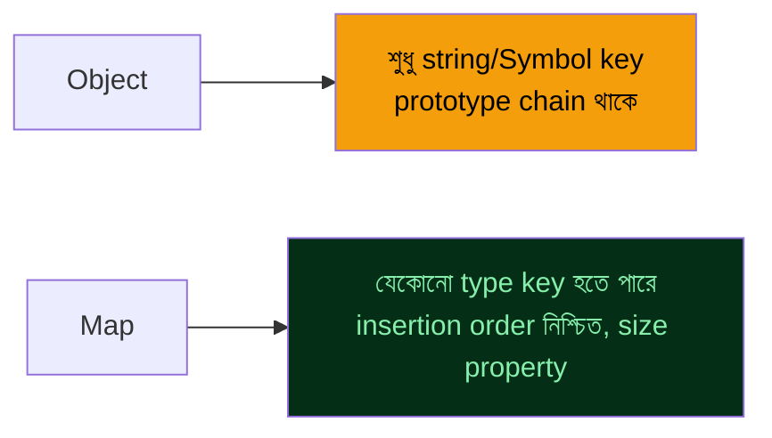

```js
const userRoles = new Map();
userRoles.set("rahim", "admin");
userRoles.set("karim", "editor");

console.log(userRoles.get("rahim"));   // "admin"
console.log(userRoles.size);            // 2
console.log(userRoles.has("karim"));   // true

for (const [user, role] of userRoles) {
  console.log(user, role);
}
```

### Set — শুধু unique value-এর collection

```js
const uniqueNumbers = new Set([1, 2, 2, 3, 3, 3]);
console.log([...uniqueNumbers]);   // [1, 2, 3] — duplicate নিজে থেকেই বাদ

uniqueNumbers.add(4);
uniqueNumbers.has(2);      // true
uniqueNumbers.delete(1);

// বাস্তব ব্যবহার — array থেকে দ্রুত duplicate সরানো
const numbers = [1, 2, 2, 3, 4, 4, 5];
const unique = [...new Set(numbers)];   // [1, 2, 3, 4, 5]
```

> 💡 Object-এর key শুধু string/Symbol হতে পারে (number দিলেও string-এ convert হয়ে যায়), কিন্তু Map-এ যেকোনো type (object, function, এমনকি NaN) key হতে পারে।

---

## Module 14 — Promises

### Definition
Promise হলো একটা asynchronous operation-এর **ভবিষ্যত ফলাফল**-এর representation — যেটা তিনটা অবস্থার একটাতে থাকে: `pending`, `fulfilled`, বা `rejected`।

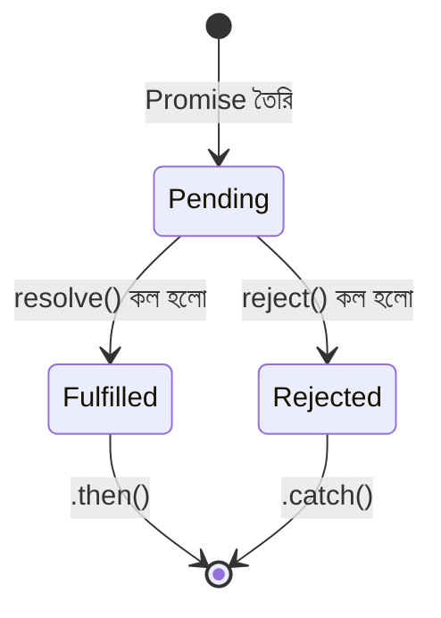

```js
function fetchUser(id) {
  return new Promise((resolve, reject) => {
    setTimeout(() => {
      if (id > 0) {
        resolve({ id, name: "Ayesha" });
      } else {
        reject(new Error("Invalid user id"));
      }
    }, 1000);
  });
}

fetchUser(1)
  .then((user) => {
    console.log(user);
    return fetchUser(2);   // chaining — পরের Promise return করা
  })
  .then((user2) => console.log(user2))
  .catch((error) => console.error("ব্যর্থ:", error.message))
  .finally(() => console.log("শেষ — সফল হোক বা না হোক"));

// একাধিক Promise একসাথে — সব সফল হলে
Promise.all([fetchUser(1), fetchUser(2)])
  .then(([user1, user2]) => console.log(user1, user2));

// একাধিক Promise — যেটা আগে শেষ হয়
Promise.race([fetchUser(1), fetchUser(2)]);

// একাধিক Promise — সব ফলাফল (fail হলেও) জানা
Promise.allSettled([fetchUser(1), fetchUser(-1)])
  .then((results) => console.log(results));
```

| Method | কখন ব্যবহার |
|---|---|
| `Promise.all()` | সবগুলো দরকার, একটাও fail করলে পুরোটা fail |
| `Promise.allSettled()` | সবগুলোর ফলাফল দরকার, fail হলেও চলবে |
| `Promise.race()` | যেটা আগে শেষ হয় সেটাই যথেষ্ট |
| `Promise.any()` | প্রথম **সফল** ফলাফল যথেষ্ট |

> ❌ **Common mistake:** Promise chain-এ `.catch()` না দেওয়া — error silently swallow হয়ে যায় বা "unhandled promise rejection" warning আসে।

---

## Module 15 — Async/Await

### Definition
`async`/`await` হলো Promise-এর উপর বসানো syntax sugar — asynchronous code-কে synchronous-এর মতো পড়া ও লেখার সুবিধা দেয়।

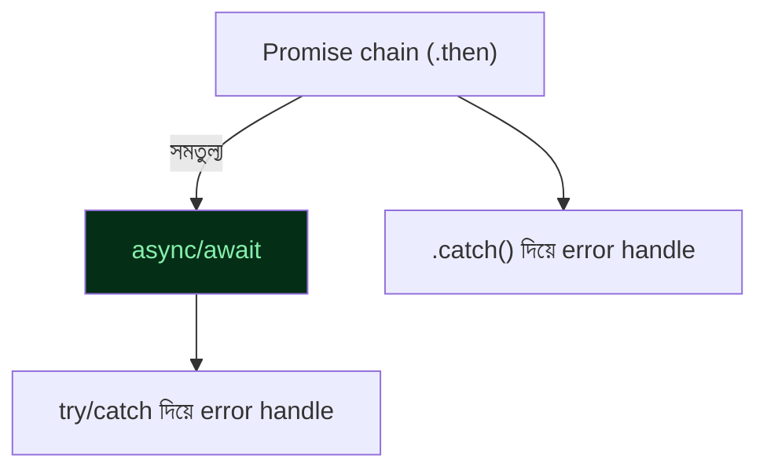

```js
// Promise chain (আগের style)
function loadUserOld() {
  return fetchUser(1)
    .then((user) => fetchPosts(user.id))
    .then((posts) => console.log(posts))
    .catch((err) => console.error(err));
}

// ✅ async/await — একই কাজ, অনেক বেশি পরিষ্কার
async function loadUser() {
  try {
    const user = await fetchUser(1);
    const posts = await fetchPosts(user.id);
    console.log(posts);
  } catch (err) {
    console.error("সমস্যা হয়েছে:", err.message);
  }
}

// একাধিক async কাজ প্যারালালে চালানো — sequential না করে
async function loadDashboard() {
  // ❌ ধীর — একটার পর একটা অপেক্ষা করছে
  const user = await fetchUser(1);
  const stats = await fetchStats(1);

  // ✅ দ্রুত — দুটোই একসাথে শুরু হয়
  const [userFast, statsFast] = await Promise.all([
    fetchUser(1),
    fetchStats(1),
  ]);
}

// top-level await (ES2022+, module-এর ভেতরে সরাসরি)
const data = await fetchUser(1);
console.log(data);
```

> ❌ **সবচেয়ে সাধারণ ভুল:** independent async operation-গুলো একটার পর একটা `await` করা যখন সেগুলো একসাথে (parallel-এ) চালানো যেত — এতে অকারণে সময় নষ্ট হয়। `Promise.all()` দিয়ে parallel করো যখন কাজগুলো একে অপরের উপর নির্ভর করে না।

> ❌ `async` function-এর ভেতরে `try/catch` ছাড়া `await` ব্যবহার করা — error handle না করলে app crash করতে পারে বা silent failure হয়।

---

## Module 16 — Optional Chaining & Nullish Coalescing

```js
const user = {
  name: "Nafisa",
  address: {
    city: "Dhaka",
  },
};

// ❌ পুরোনো পদ্ধতি — deep property access করতে বারবার check
const zip = user.address && user.address.zip && user.address.zip.code;

// ✅ Optional chaining (?.) — কোনো ধাপ null/undefined হলে সাথে সাথে থেমে undefined দেয়
const zipNew = user.address?.zip?.code;   // undefined, কোনো error নয়

// Function call-এও ব্যবহার হয়
user.greet?.();   // greet না থাকলে চুপচাপ skip, TypeError আসবে না

// Array-তেও
const firstItem = user.orders?.[0];

// Nullish coalescing (??) — শুধু null/undefined হলে default বসায়
const count = 0;
console.log(count || 10);   // 10 — ❌ ভুল! 0 falsy বলে || এটাকেও replace করে
console.log(count ?? 10);   // 0  — ✅ ঠিক! শুধু null/undefined হলে replace করবে

const settings = { volume: 0, brightness: null };
const volume = settings.volume ?? 50;         // 0 (ঠিক আছে, আসল মান রাখল)
const brightness = settings.brightness ?? 50; // 50 (null ছিল বলে default বসল)
```

> ⚠️ **`||` এবং `??`-এর পার্থক্য মনে রাখা জরুরি:** `||` যেকোনো falsy value (`0`, `""`, `false`, `NaN`) replace করে, কিন্তু `??` শুধু `null` ও `undefined`-এর জন্য কাজ করে। Numeric বা boolean default value সেট করার সময় প্রায় সবসময় `??` ব্যবহার করা উচিত।

---

## Module 17 — Error Handling

```js
// Custom error class — extends Error
class ValidationError extends Error {
  constructor(message, field) {
    super(message);
    this.name = "ValidationError";
    this.field = field;
  }
}

function validateAge(age) {
  if (age < 0) {
    throw new ValidationError("বয়স ঋণাত্মক হতে পারে না", "age");
  }
  return age;
}

try {
  validateAge(-5);
} catch (error) {
  if (error instanceof ValidationError) {
    console.error(`Validation failed on ${error.field}: ${error.message}`);
  } else {
    console.error("অপ্রত্যাশিত error:", error);
  }
} finally {
  console.log("Validation attempt শেষ");
}

// Async error handling
async function safeDivide(a, b) {
  try {
    if (b === 0) throw new Error("শূন্য দিয়ে ভাগ করা যায় না");
    return a / b;
  } catch (error) {
    console.error(error.message);
    return null;   // graceful fallback
  }
}
```

> ❌ Generic `Error`-এর বদলে সবসময় খালি `throw "কিছু ভুল হয়েছে"` (string throw) করা — `instanceof` check কাজ করবে না, stack trace পাওয়া যাবে না। সবসময় `Error` (বা subclass) instance throw করো।

---

## Module 18 — Proxy & Reflect

### Definition
`Proxy` একটা object-এর আচরণ (get, set, delete ইত্যাদি) intercept করে custom logic বসানোর সুযোগ দেয় — যেমন validation, logging, বা reactive system (Vue-এর reactivity এভাবেই কাজ করে)।

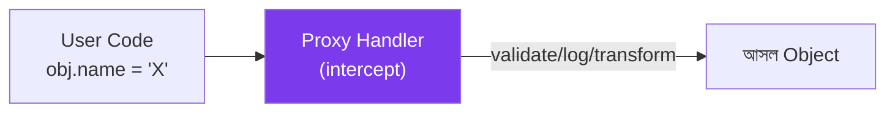

```js
const validator = {
  set(target, property, value) {
    if (property === "age" && (typeof value !== "number" || value < 0)) {
      throw new TypeError("বয়স অবশ্যই একটা positive number হতে হবে");
    }
    target[property] = value;
    return true;
  },
  get(target, property) {
    console.log(`পড়া হচ্ছে: ${property}`);
    return target[property];
  },
};

const user = new Proxy({}, validator);
user.age = 25;        // ঠিক আছে
console.log(user.age); // লগ হবে: "পড়া হচ্ছে: age" → 25
user.age = -5;          // ❌ TypeError
```

> 💡 এটা advanced feature — সরাসরি রোজকার কোডে কম লাগে, কিন্তু framework/library (Vue 3 reactivity, validation library, ORM) কীভাবে কাজ করে বুঝতে সাহায্য করে।

---

## Module 19 — Tooling & Best Practices

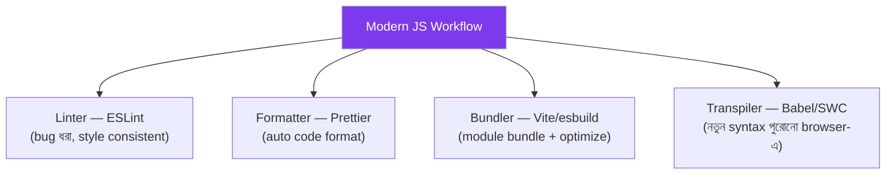

### ✅ সেরা practice checklist

| নিয়ম | কারণ |
|---|---|
| `const` ডিফল্ট, প্রয়োজনে `let`, `var` কখনো না | Predictable scope, কম bug |
| `===` ব্যবহার করো, `==` নয় | Type coercion-এর অপ্রত্যাশিত আচরণ এড়ানো |
| Pure function পছন্দ করো (input বদলায় না) | Testable, predictable, debug সহজ |
| Immutable update — spread ব্যবহার করো, mutate নয় | State ট্র্যাক করা সহজ হয় |
| Async operation-এ সবসময় error handle করো | Silent failure রোধ |
| Meaningful variable/function নাম দাও | Self-documenting code |
| Deep nesting এড়িয়ে early return ব্যবহার করো | পড়া সহজ হয় |

```js
// ❌ Deep nesting
function processOrder(order) {
  if (order) {
    if (order.items.length > 0) {
      if (order.paid) {
        return "প্রসেস হচ্ছে";
      }
    }
  }
}

// ✅ Early return — পরিষ্কার, flat structure
function processOrderClean(order) {
  if (!order) return null;
  if (order.items.length === 0) return null;
  if (!order.paid) return null;
  return "প্রসেস হচ্ছে";
}
```

> ❌ `==` (loose equality) ব্যবহার করা — `"5" == 5` হলো `true`, যেটা bug-এর উৎস। সবসময় `===` (strict equality) ব্যবহার করো।

---

## Module 20 — Project Build Track

### 🚀 ক্রম মেনে এগোও

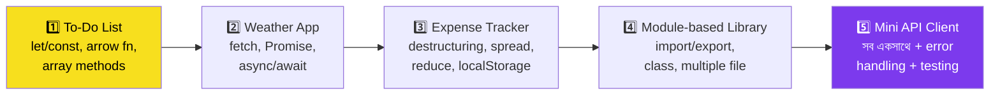

| Project | মূল দক্ষতা |
|---|---|
| **To-Do List** | `let`/`const`, arrow function, `map`/`filter`, template literal |
| **Weather App** | `fetch()`, Promise chaining, async/await, error handling |
| **Expense Tracker** | Destructuring, spread/rest, `reduce()`, Map/Set, localStorage |
| **Module-based Library** | `import`/`export`, class, multi-file organization |
| **Mini API Client** | সব concept একসাথে + custom error class + async patterns |

### 🔄 একটা সাধারণ প্রবাহ (Expense Tracker উদাহরণ)

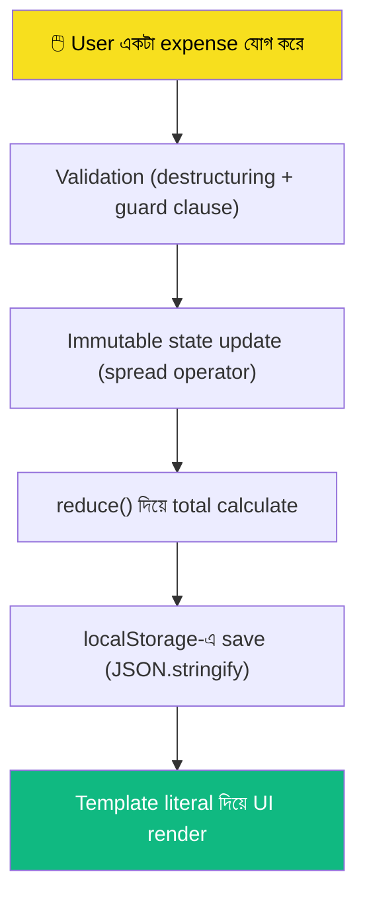

---

## ✅ ES6+-Ready Checklist

- [ ] `let`/`const`/`var`-এর scope পার্থক্য ব্যাখ্যা করতে পারি
- [ ] Arrow function-এর `this` কীভাবে কাজ করে বুঝি
- [ ] Destructuring ও spread/rest সাবলীলভাবে ব্যবহার করতে পারি
- [ ] `map`/`filter`/`reduce` দিয়ে data transform করতে পারি
- [ ] `class` দিয়ে inheritance লিখতে পারি
- [ ] `import`/`export` দিয়ে module organize করতে পারি
- [ ] Promise ও async/await-এর পার্থক্য ও ব্যবহার জানি
- [ ] `?.` ও `??`-এর সঠিক ব্যবহার জানি
- [ ] Custom Error class দিয়ে error handle করতে পারি
- [ ] নিজের একটা multi-file JS project বানিয়েছি

> দশটার মধ্যে ৮টা ✅ হলে তুমি ES6+ ready!

---

## 📚 Reference Links

<div align="center">

[](https://developer.mozilla.org/en-US/docs/Web/JavaScript)
[](https://nodejs.org)
[](https://tc39.es/ecma262/)
[](https://javascript.info)
[](https://eslint.org)

</div>

| বিষয় | লিংক |
|---|---|
| MDN JavaScript Guide | https://developer.mozilla.org/en-US/docs/Web/JavaScript/Guide |
| JavaScript.info (সম্পূর্ণ ফ্রি টিউটোরিয়াল) | https://javascript.info |
| ECMAScript Specification | https://tc39.es/ecma262/ |
| Can I Use (browser support চেক) | https://caniuse.com |
| Node.js Docs | https://nodejs.org/docs/latest/api/ |
| ESLint | https://eslint.org |

---

<div align="center">

### 💡 *"Syntax মুখস্থ করো না, ধারণা বোঝো — syntax আসবে অনুশীলনে।"*

⭐ কাজে লাগলে repo-টা star দাও!

<sub>Version note: ECMAScript 2015 (ES6) থেকে ES2024 পর্যন্ত feature অনুযায়ী লেখা। Language spec ধীরে বদলায়, কিন্তু নতুন feature যোগ হয় প্রতি বছর — সর্বশেষ update-এর জন্য MDN-এ মিলিয়ে নিয়ো।</sub>


</div>


